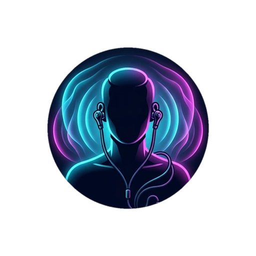

<p align="center">
  
</p>

<h1 align="center">CodeWave</h1>

<p align="center">
  <strong>Industry-Grade Hi-Res Audio Workstation & Lossless Downloader for Android</strong>
</p>

<p align="center">
  <a href="https://github.com/santjsx/CodeWave/releases/latest"></a>
  
  
  
  
  
  
</p>

---

## ⚡ Why CodeWave?

CodeWave bridges audiophile local playback, adaptive online audio streaming, and high-fidelity lossless downloads inside a single, unified Obsidian IDE workstation interface:

1. **Unfiltered Audio Transparency (Zero Placebo)**  
   CodeWave’s **Signature Track Inspector** reveals the real technical pipeline: true file **SOURCE** decoding vs. actual hardware **OUTPUT** device routing, sample rate, bit depth, buffer latency, and active stream cache telemetry.
2. **True 32-Bit Studio Dynamics Processing (DSP)**  
   No muddy software EQ filters. CodeWave drives Android's hardware `DynamicsProcessing` engine with 10 studio bands (`31 Hz` to `16 kHz`), a calibrated center-zero Master Preamp gain, and transparent limiter anti-clipping protection.
3. **Adaptive Online Audio Streaming**  
   Instant online music exploration powered by direct InnerTube API integration. Streams high-bitrate Opus (160 kbps) and AAC (140 kbps) through an intelligent 512 MB LRU disk cache, routed directly into the 32-bit float DSP pipeline.
4. **Lossless Audio Downloader & Ingest Pipeline**  
   Download true 24-bit / 96 kHz FLAC files directly to your device storage. Supports URL resolving across major streaming platforms, pure Kotlin Vorbis comment tagging with album art embedding, and instant MediaStore indexing.
5. **Absolute Privacy & Zero Advertising**  
   No accounts, no logins, no telemetry tracking, and zero ads. Your data and downloads remain strictly yours.
6. **Developer-Grade Obsidian Aesthetic**  
   Designed with an IDE workstation theme: deep dark palette (`#0B0D10`), illuminated cyan/neon telemetry, console faders, and glass vitrine containers.

---

## 🎧 Core Features & API Integrations

### 🌐 Online Streaming & Media3 Caching
- **InnerTube Streaming API**: Search across millions of tracks and explore trending charts directly from the app with zero account login required.
- **Media3 LRU Disk Caching**: 512 MB LRU disk cache (`SimpleCache` + `CacheDataSource.Factory`) ensures rapid playback startup, offline segment replay, and zero repeated bandwidth consumption.
- **LRCLIB Synced Lyrics API**: Online synced and plain lyrics fallback when local `.lrc` files are not present on disk.
- **Hardware DSP Route**: Online streams flow through the exact same 32-bit float `DynamicsProcessing` audio graph and 10-band studio graphic EQ as local lossless files.

### 💾 Lossless FLAC Downloader Center
- **Multi-Service Metadata Resolver API**: Resolves track information, cover artwork, and ISRC codes from Spotify (via public oEmbed), Tidal, and YouTube URLs.
- **Lossless Cascade Provider**: Multi-tiered discovery engine prioritizing custom extension APIs and lossless audio sources, with adaptive audio fallback.
- **Pure-Kotlin FLAC Vorbis Comment Tagger**: RFC-compliant Xiph FLAC metadata tagger written in pure Kotlin with zero native JNI overhead. Embeds `TITLE`, `ARTIST`, `ALBUM`, `ISRC`, `DATE`, `TRACKNUMBER`, and `METADATA_BLOCK_PICTURE` front cover art.
- **Android Scoped Storage MediaStore Ingest**: Writes directly to `Music/CodeWave` using atomic `IS_PENDING = 1` -> `0` transactions, followed by instantaneous MediaStore scanning into the local library.
- **Background Download Service**: Foreground notification with real-time download speed calculation (`MB/s`), progress tracking, and coroutine cancellation support.

### 🎛️ Local Audio & DSP Engine
- **Float32 Master DSP Console**: 10-band studio graphic EQ, bipolar master preamp slider (`-12 dB` to `+12 dB`), and 12 tuned acoustic sound profiles.
- **Glass Vitrine Playlist Containers**: Physical shelf display aesthetic featuring album art nested inside frosted glass containers with specular reflections.
- **Track Inspector Sheet**: Deep technical telemetry showing audio container format, bit depth, stream cache status, and hardware output device specifications.
- **Instant SQLite FTS4 Search**: Unicode-aware full-text search across local tracks, albums, artists, and online streams.

---

## 🛠️ Architecture & Tech Stack

| Layer | Technologies & Libraries |
|---|---|
| **UI & Presentation** | Jetpack Compose (BOM 2026), Material 3, Custom Canvas Shaders, Obsidian Design System |
| **Audio Engine** | AndroidX Media3 ExoPlayer 1.5.1, `MediaSessionService`, `Media3CacheManager`, `AudioFocusManager` |
| **DSP & Equalizer** | Android `DynamicsProcessing` (32-bit float), PreEQ Gain Staging, Limiter Guard |
| **Network & APIs** | OkHttp 4.12, InnerTube API Client, Spotify oEmbed Resolver, LRCLIB Synced Lyrics API |
| **Download & Tagging** | Pure-Kotlin RFC Xiph FLAC Tagger, Android Scoped Storage MediaStore API, Foreground Service |
| **Database & Cache** | Room 2.8.5 with SQLite FTS4 (Schema v2 Migration), DataStore Preferences, 512MB LRU Disk Cache, Coil 2.7 |
| **Language & Tooling** | Kotlin 2.3, Coroutines & StateFlow, Gradle 9.1 Kotlin DSL, R8 Full Mode Shrinking |

---

## 📥 Download & Installation

Grab the latest signed production APK directly from **[GitHub Releases](https://github.com/santjsx/CodeWave/releases/latest)**:

1. Download **`app-release.apk`**.
2. Tap the downloaded file to install (enable "Install unknown apps" if prompted).
3. CodeWave updates itself seamlessly through its built-in OTA updater.

---

## 🏗️ Building from Source

```bash
# Clone repository
git clone https://github.com/santjsx/CodeWave.git
cd CodeWave

# Run automated unit tests
./gradlew testDebugUnitTest

# Build debug APK
./gradlew assembleDebug

# Build optimized release APK
./gradlew assembleRelease
```

---

## 📄 License

Designed and developed with care. Open source under the Apache License 2.0.
